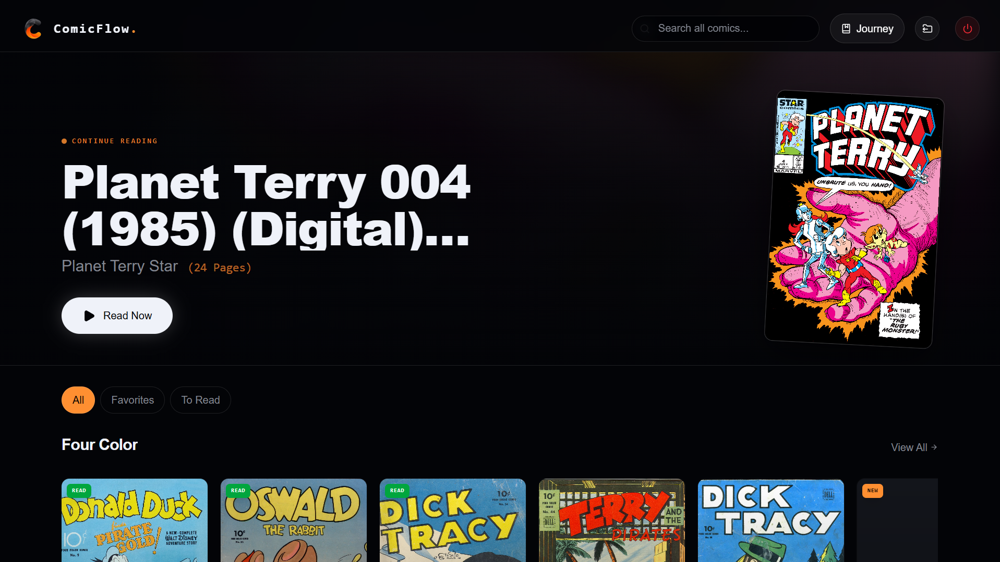

<div align="center">
  
  
  <h1>ComicFlow Website</h1>
  
  <p>
    <strong>The official landing page for ComicFlow — a modern, fast, and private local comic reader for Windows.</strong>
  </p>

  <p>
    <a href="https://comicflowapp.netlify.app"><strong>Visit the Live Site & Download the App</strong></a>
  </p>
</div>

<br />

<div align="center">
  <!-- PLACEHOLDER: MAIN DASHBOARD IMAGE -->
  
</div>

<br />

## About The Project

This repository contains the source code for the ComicFlow landing page. 

ComicFlow itself is a desktop application built to solve a specific problem: most local comic readers for Windows are either bloated with ads, require cloud accounts, or feature outdated interfaces. ComicFlow is built to be a lightning-fast, 100% private, and visually modern reader for `.cbz` and `.cbr` files.

### Key Features of the App
* **Zero Ads & 100% Local:** No accounts, no cloud tracking, and no subscriptions.
* **Modern UI:** A clean, ambient interface designed to let the artwork take center stage.
* **Library Management:** A built-in vault to organize and sort your digital collection.
* **Reading Insights:** Locally tracked statistics on your reading habits.

<br />

<div align="center">
  <!-- PLACEHOLDER: READER MODE IMAGE -->
  
</div>

<br />

## Web Tech Stack

While the desktop app is powered by Tauri and Rust, this landing page is engineered for speed and fluid animations using modern web technologies:

* **Framework:** [Next.js](https://nextjs.org/) (React)
* **Styling:** [Tailwind CSS](https://tailwindcss.com/)
* **Animations:** [Framer Motion](https://www.framer.com/motion/)
* **Icons:** [Lucide React](https://lucide.dev/)
* **Deployment:** [Netlify](https://www.netlify.com/) (CI/CD)

## Running the Website Locally

If you want to explore the source code of this landing page, you can run it locally:

1. Clone the repository:
   ```bash
   git clone [https://github.com/Ansari-M-Rayyan/comicflow-website.git](https://github.com/Ansari-M-Rayyan/comicflow-website.git)
